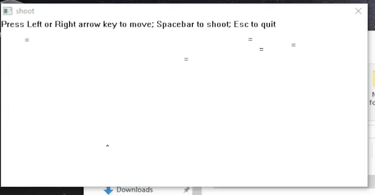

## shoot v0.03

A Win32 shooting game prototype, with three elements

* Moving of gun to the left and to the right (arrow key)

* Moving of bullet (space bar)

* Moving of enemies based on random number generator (flawed as it tends to move to the left of window)

### How to compile

Compile using Flat Assembler for Windows, using its IDE `FASMW.EXE`.

This is standalone EXE, supports minimum Windows XP, but only tested on Windows 10 22H2.

### Credits

Special thanks for FASM message board members:

* @revolution: For his random number generator

* @macomics: For his help in solving Timer problem
